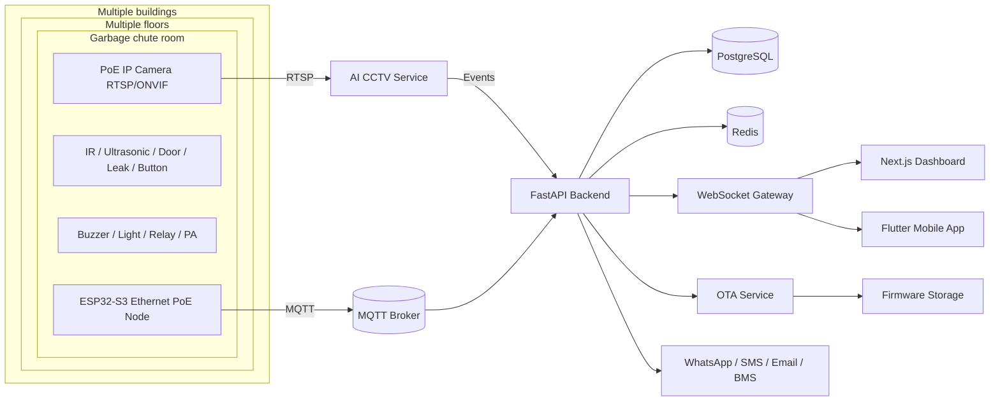

# Architecture

## Key design points
- One controller per room
- VLAN-ready Ethernet topology
- MQTT for sensor telemetry and control
- RTSP AI analytics for image-based misuse detection
- OTA managed centrally with rollback-ready metadata
- Shared room model across dashboard, mobile app, and backend APIs
